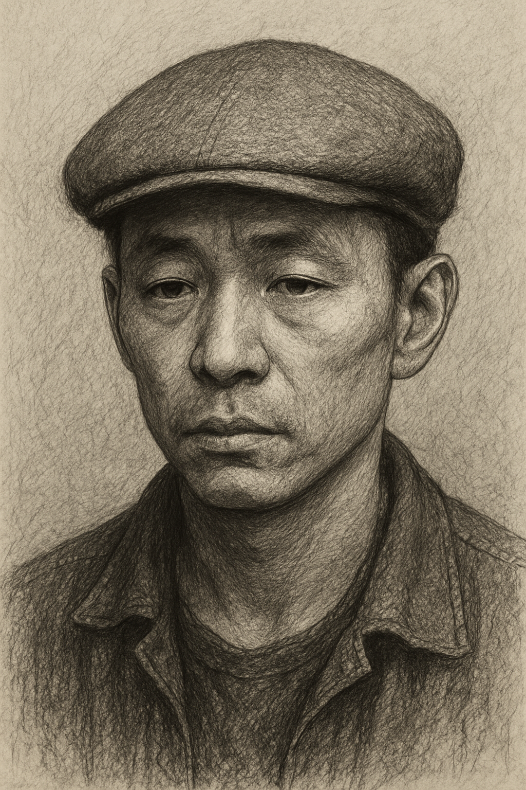

# Lucky Bill

**Edad:** 30-40 Años  
**Ocupación:** Superviviente errante  
**Ubicación actual:** Desconocida (se mueve constantemente)  
**Estado:** Vivo, aunque nadie sabe por cuánto tiempo

## Descripción física
Hombre de unos 30-40 años asiatico, con poco pelo e imberbe bajo una boina marron. Con mirada apagada.

## Personalidad
- Carismático sin pretenderlo  
- Supersticioso  
- Improvisador  
- Suele creer que “la suerte” le protege, aunque a veces solo lo mete en más problemas  

## Historia
Lucky Bill es conocido por aparecer en los lugares menos oportunos… y sobrevivir de formas que nadie consigue explicar.  

## Relaciones
- **Cody Bravo**: Respeto mutuo; Cody desconfía de su “suerte”, pero reconoce que Bill puede ser útil.  
- No tiene aliados estables; suele moverse solo.

## Objetos / Inventario
- Una baraja incompleta  
- Una cantimplora que dice “bendita por el destino”

## Apariciones importantes
- Ha ofrecido “trabajos” a otros supervivientes recientemente  
- Visto cruzando el centro poco antes de un apagón inexplicable

## Citas

